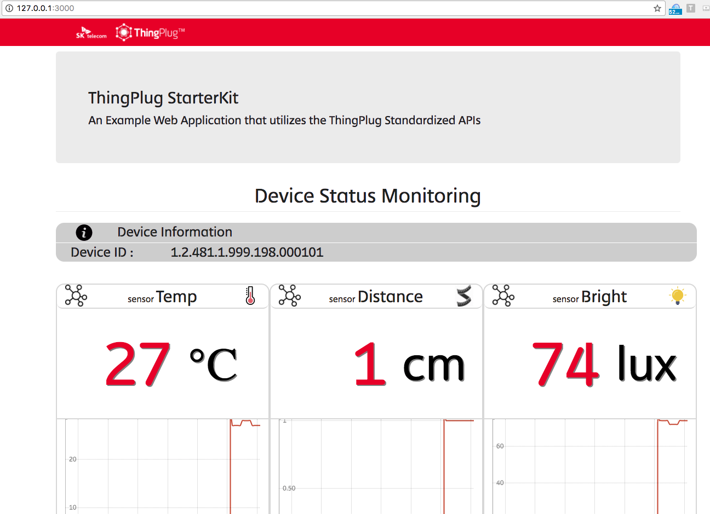

# 시나리오

### 1. 온도 센서
#### 온도가 33도 초과인 경우
Emergency 상황 발생, 빨간색 LED ON
#### 온도가 33도 이하인 경우
빨간색 LED OFF

### 2. 조도 센서
#### 밝기가 200lux 미만인 경우
해가 졌으니, 파란색 LED ON
#### 밝기가 200lux 이상인 경우
파란색 LED OFF

### 3. 초음파 센서
#### 초음파센서와 사람의 거리가 50cm 미만인 경우
집에 수상한 사람 등장, Take Photo!

문자 LCD ON!

#### 아래 Take Photo 버튼 클릭
Take Photo!

# 전시지원

## 하드웨어 설치
### 1. Arduino

1) 쉴드가 3층으로 이루어져 있는지 확인합니다.(1층 : 아두이노, 2층 : 유선랜, 3층 센서 연결 쉴드)

2) 특히 3층에는 정상적으로 센서들이 꽂혀있는지 확인합니다.(A0 : 온도, D3 : 적LED, D4 : 청LED, I2C : LCD, A3 : 조도, D8 : 초음파)

#### a 인터넷
1) 현장 유선 공유기(또는 랜선)에 인터넷이 정상적으로 들어오는지 확인합니다.

2) 랜선을 공유기에 연결합니다.

3) 랜선의 반대쪽을 Arduino에 연결합니다.

#### b. 전원

1) Arduino에 검정색 전원 케이블을 삽입합니다.

### 2. Raspberry PI
#### a 인터넷
1) 현장 유선 공유기(또는 랜선)에 인터넷이 정상적으로 들어오는지 확인합니다.

2) 랜선을 공유기에 연결합니다.

3) 랜선의 반대쪽을 Arduino에 연결합니다.

#### b. 전원

1) 파이 카메라가 정상적으로 연결되어있나 확인합니다

2) PI에 검정색 전원 케이블을 삽입합니다.

## 소프트웨어 실행
1) Arduino와 Raspberry PI 모두 전원 연결 후 자동으로 실행이 됩니다.(부팅 시간 1분 이상 소요)

2) Chrome 브라우저 설치 후 페이지로 이동합니다.(구글 브라우저)

3) 접속 방법 : PC에서 공유기를 확인하여 라즈베리파이의 IP를 확인 또는 라즈베리파이의 인터넷 IP를 확인한 뒤, 라즈베리파이IP:3000로 Chrome에서 이동합니다

(공유기 예 : 192.168.0.10:3000, 인터넷 예 : 111.222.33.4:3000)

4) 페이지가 없는 경우 라즈베리파이의 IP부터 확인해주세요

## Trouble Shooting

### 1) 인터넷이 안되는것 같아요

아두이노 또는 파이의 랜선 왼쪽 주황색 LED가 깜빡이는지, 오른쪽 초록 LED가 켜져있는지 확인해주세요, 그렇지 않은 경우 현장의 인터넷이 불안정할 확률이 높습니다.

### 2) 아두이노에서 센서값이 올라오지 않아요

####a) 순간적으로 안되는 경우 : 전원을 뽑았다가 다시 연결해주세요

01) Boards Manager에 Curie Arduino/Genuino101이 없는 경우 Boards Manager를 이용해 설치합니다(버전 1.0.7)

02) Board와 Port세팅을 합니다(이때 Port는 Bluetooth말고, com 또는 serial이라고 적혀있는 것을 선택합니다)

03) Serial Monitor를 통해 데이터가 잘 전달되고 있는지 확인합니다 (201메시지가 아닌 다른 숫자가 보이거나 에러메시지가 보이는 경우 문의 또는 초기화를 진행해주세요)

### 3) 아두이노 센서값이 올라오지 않아 초기화를 진행해야 합니다

####b) log확인을 해야 하는 경우(또는 초기화를 해야 하는 경우)

01) 작업할 PC에 아두이노 프로그래밍 툴인 Sketch를 설치합니다. [바로가기](https://www.arduino.cc/en/tutorial/sketch)

02) ThingPlug StarterKit Exhibit 버전을 다운로드합니다. [바로가기](https://github.com/SKT-ThingPlug/thingplug-starter-kit-exhibit)

03) IDE가 설치되면, 각 PC환경의 홈 폴더에 Arduino 폴더가 생깁니다.

04) Arduino/libraries 에 oneM2M 폴더와 libraries 내의 Time, Grove_LCD.. 폴더를 이동시킵니다.

05) Arduino/example에 oneM2M 폴더 안에 있는 example안의 내용을 이동시킵니다.

06) SDK 설치가 완료되었습니다.

Home 이하 폴더구조

---> Arduino

------> examples

---------> ThingPlug_oneM2M_SDK

------> libraries

---------> oneM2M

---------> Grove_LCD...

---------> Time

07) Arduino - example - ThingPlug_oneM2M_SDK - src - MA - Configuration.h 파일을 수정합니다

수정필요

USER : "demoday"

PASSWORD : "uKey" (담당자 문의)

CSEBASE : "ThingPlug"

NODE_ID : "1.2.481.1.999.198.000101"

07) SDK를 스케치에서 불러옵니다

08) Board와 Port세팅을 합니다(이때 Port는 Bluetooth말고, com 또는 serial이라고 적혀있는 것을 선택합니다)

09) Tools 에서 아래와 같이 Firmware Updater를 선택합니다.

10) Upload를 실행합니다.(-> 화살표 버튼)

11) Serial을 다시 확인해봅니다.

### 3) 라즈베리파이 사진이 안찍혀요

1) 파이 카메라가 정상적으로 연결되어있나 확인합니다

2) 라즈베리파이를 전원을 뺐다 연결합니다.(전원 연결후 1분이상 대기)

3) 연결이 되지 않는 경우 putty를 실행합니다. [다운로드](https://www.chiark.greenend.org.uk/~sgtatham/putty/latest.html)

4) 실행한뒤 HostName에 라즈베리파이의 IP를 입력하고 Open합니다.

5) ID, PW를 입력합니다 (ID : pi, PW: raspberry)

6) sudo /etc/init.d/middleware-mini restart 입력합니다.

7) 그래도 사진이 안나올 경우 담당자에게 연락합니다.
